# SagràApp — Guida Utente

Guida pratica per il personale della sagra: cameriere, cucina, bar, cassa e admin.
Da leggere prima del turno. Tienila a portata di mano la prima sera.

---

## Indice

1. [Accesso all'app](#1-accesso-allapp)
2. [Guida Cameriere](#2-guida-cameriere)
3. [Guida Cucina](#3-guida-cucina)
4. [Guida Bar](#4-guida-bar)
5. [Guida Cassa](#5-guida-cassa)
6. [Guida Admin](#6-guida-admin)

---

## 1) Accesso all'app

L'app si apre in qualsiasi browser dal telefono o dal tablet. Appena la apri vedi una **tastiera numerica**: ognuno ha il suo PIN personale.

### Inserisci il PIN

Premi i tasti del tuo PIN. Per i ruoli operativi (cameriere, cucina, bar, cassa) il PIN è di **4 cifre**. Per l'admin è di **6 cifre**.

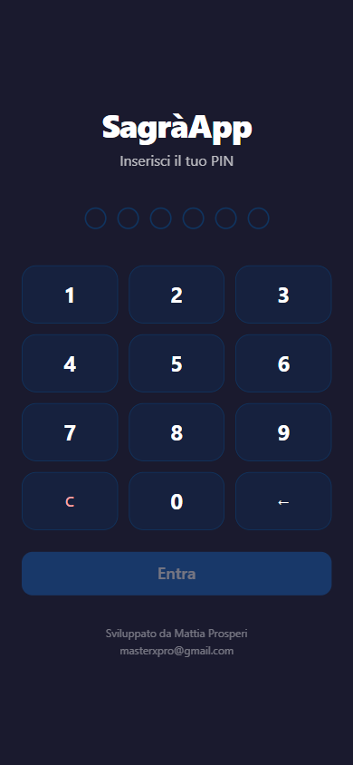

Mentre digiti, i pallini in alto si riempiono. Se sbagli, usa **C** per cancellare tutto o **←** per cancellare l'ultima cifra.

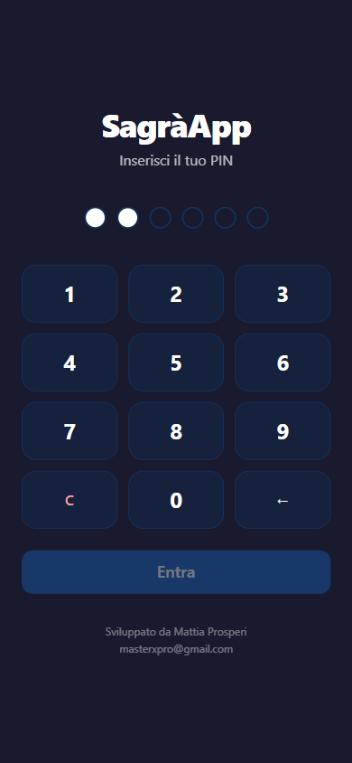

Quando hai finito, premi **Entra**. Se il PIN è giusto vieni mandato direttamente alla schermata del tuo ruolo.

> ⚠️ Non condividere il PIN con altri. Se lo dimentichi, chiedi all'admin di rigenerartelo.

---

## 2) Guida Cameriere

Il cameriere prende le ordinazioni al tavolo e le invia in cucina e al bar.

### 2.1 La lista dei tuoi tavoli

Appena entri, vedi la lista dei tavoli aperti. In cima c'è il pulsante **+ Nuovo Tavolo** sempre disponibile.

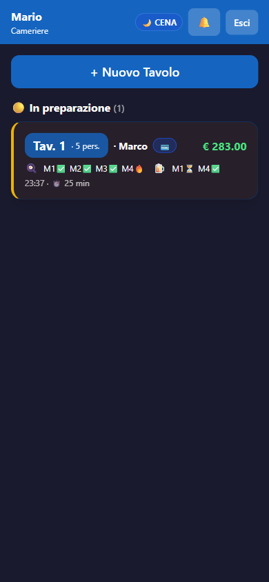

Quando ci sono ordini attivi, ogni tavolo è una **card** colorata in base allo stato della cucina/bar.

### 2.2 Apri un nuovo tavolo

Premi **+ Nuovo Tavolo**. Compila i tre campi in alto:

- **N. Tavolo** — il numero scritto sul cartellino del tavolo
- **N. Persone** — quanti sono seduti (massimo 30)
- **Nome cliente** — il nome del capotavola (obbligatorio)

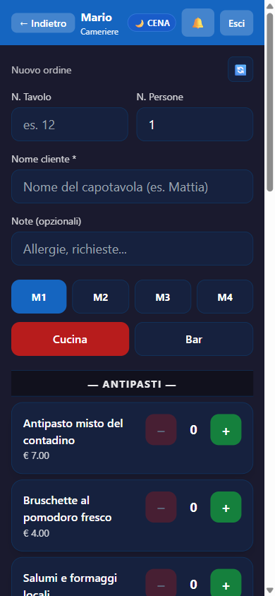

### 2.3 Componi l'ordine in mandate

L'ordine si divide in **4 mandate** (M1, M2, M3, M4). Ogni mandata si invia in cucina/bar separatamente, così si serve tutto in sequenza.

| Mandata | Cosa contiene di solito |
|--------|--------------------------|
| **M1** | Antipasti · acqua · vino |
| **M2** | Primi |
| **M3** | Secondi e contorni |
| **M4** | Dolci · caffè · amari (si invia a parte alla fine) |

Per ogni mandata seleziona prima la categoria (**Cucina** o **Bar**), poi tocca **+** sulla riga del piatto per aggiungerlo. Tieni premuto **+** o tocca più volte per aumentare la quantità.

**M1 — Cucina:**
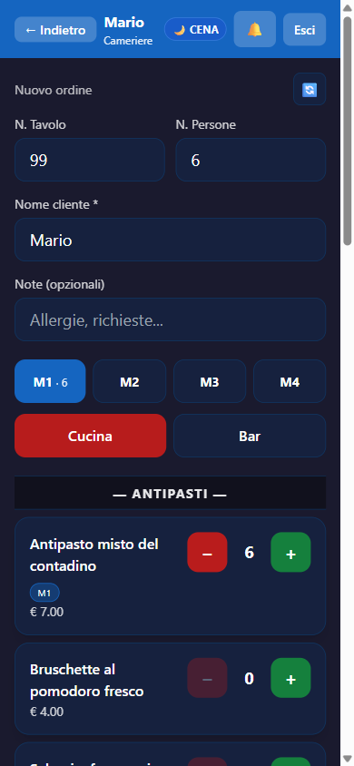

**M1 — Bar:**
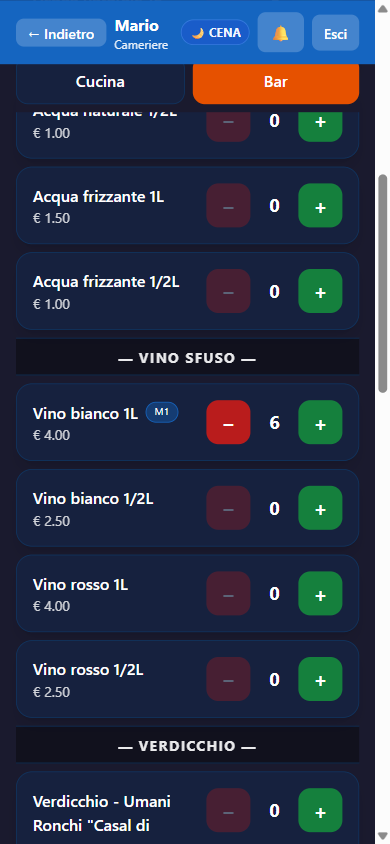

**M2 — Primi:**
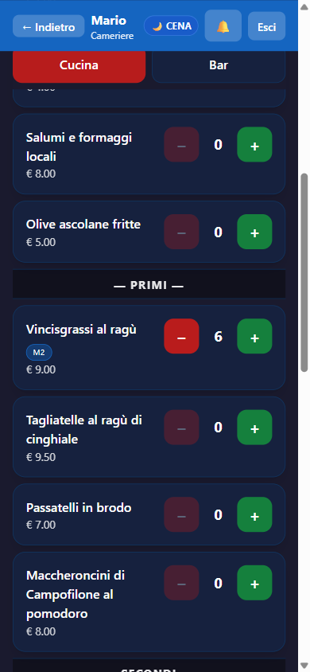

### 2.4 Scegli il pagamento

Quando hai finito di comporre tutto, premi **Avanti** in fondo. Compare la schermata di pagamento con il totale.

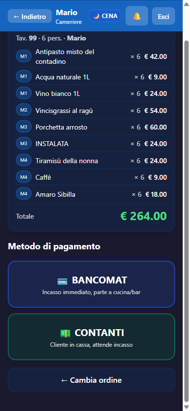

- **💳 BANCOMAT** → l'ordine è già pagato, va dritto in cucina/bar
- **💵 CONTANTI** → l'ordine finisce in cassa, parte solo dopo l'incasso

> 💡 Se il cliente cambia idea dopo il bancomat (es. paga in contanti), usa lo **storno** dal dettaglio dell'ordine — vedi più avanti.

### 2.5 Ordine inviato

Dopo aver scelto il pagamento torni alla lista tavoli. Il tavolo ora ha una card con lo stato delle mandate.

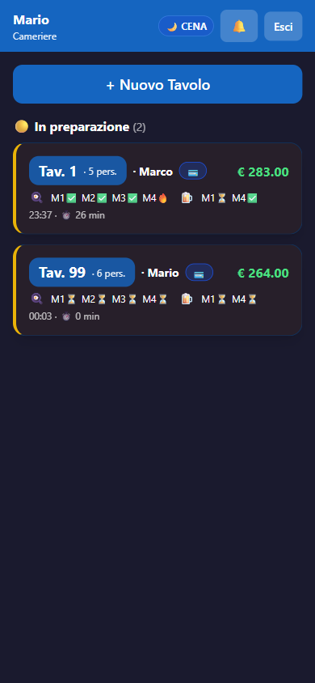

Subito dopo l'invio, la card del tavolo appare in **"🟡 In preparazione"** con i pallini di stato delle mandate (M1, M2, M3, M4):

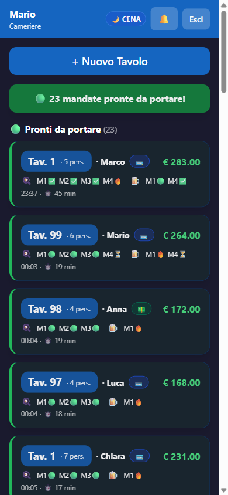

Quando cucina e bar avanzano gli stati, la card si aggiorna e i pallini cambiano (🔥 in preparazione, 🟢 pronta). Quando una mandata è pronta da portare, la card passa a **"🟢 Pronti da portare"** (verde):

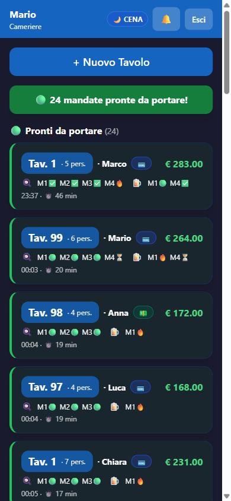

### 2.6 Dettaglio ordine e Invia M4

Tocca una card per aprire il dettaglio. Vedi tutte le mandate cucina e bar con i loro stati attuali, le quantità ordinate e i pulsanti di azione (Consegnata, Aggiungi item, Storna).

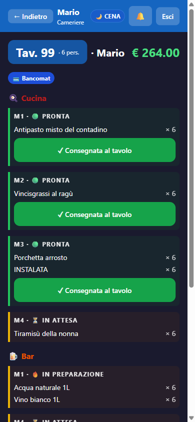

I dolci, i caffè e gli amari **restano bloccati** in cucina/bar fino a quando tu non premi esplicitamente **☕ Invia M4**. Nel dettaglio del tavolo, scorri in basso: vedrai un grosso pulsante giallo che pulsa:

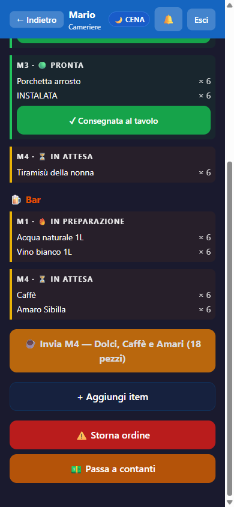

Premilo solo quando il tavolo è pronto per il dolce. Da quel momento bar e cucina vedranno le voci M4 e cominceranno a prepararle.

> ⚠️ Se non premi mai "Invia M4", dolci/caffè/amari non vengono mai preparati. Ricordatelo prima di chiudere il tavolo.

### 2.7 Riordino Rapido

Quando i clienti già seduti chiedono qualcosa in più (una bottiglia d'acqua, un caffè, un dolce in più…) non devi aprire un nuovo tavolo da capo. C'è una scorciatoia.

**1.** Trova la card del loro tavolo nella lista (sezione "🟡 In preparazione" o "🟢 Pronti da portare"). In basso a destra sulla card vedi un piccolo pulsante azzurro **+ Riordino**:

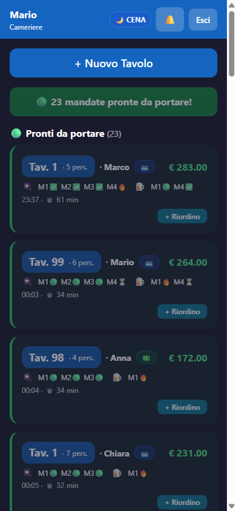

**2.** Tappa **+ Riordino** e si apre una schermata dedicata con tutto il menu in una **lista unica** (cucina sopra, bar sotto), divisa per categorie. In alto c'è una **barra di ricerca**:

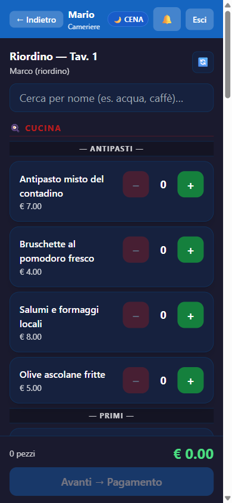

**3.** Cerca il prodotto richiesto digitando il nome (es. "acqua"). Vengono mostrati solo i risultati che corrispondono:

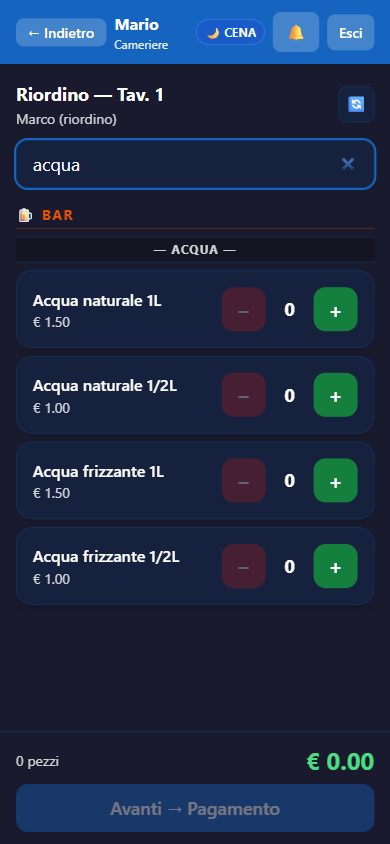

**4.** Tappa **+** per aggiungere le quantità (e **−** per toglierle). In basso vedi sempre il totale aggiornato in tempo reale.

**5.** Premi **"Avanti → Pagamento"** (è fisso in basso). Scegli il metodo (di solito **bancomat** per i riordini):

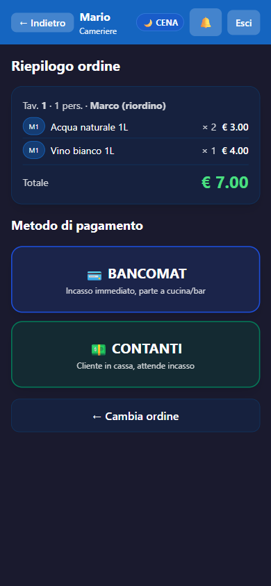

**6.** Conferma. Il riordino parte **subito** in cucina/bar e torni alla lista tavoli con la nuova card visibile:

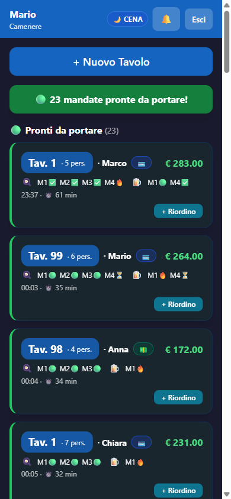

> 💡 Il riordino crea un **nuovo ordine separato** con il nome del cliente seguito da **"(riordino)"** — non modifica l'ordine originale. Così cucina e bar lo distinguono immediatamente.

> ⚠️ Tutto quello che metti in un riordino finisce automaticamente in **M1** (parte subito, niente blocco sequenziale né "Invia M4"). È pensato per richieste rapide a tavolo già seduto.

### 2.8 Storno di un ordine

Dal dettaglio del tavolo puoi premere **Storna ordine** per metterlo in pausa (es. il cliente vuole cambiare metodo di pagamento, o sbagli a inserire qualcosa). L'ordine va in cassa per essere ri-confermato.

> ⚠️ Lo storno mette in pausa tutto quello che non è ancora stato consegnato — cucina/bar vedranno il messaggio "IN PAUSA — attendi conferma cassa".

---

## 3) Guida Cucina

La cucina vede tutte le voci cucina di tutti i tavoli, divise per mandata. Le mandate cucina sono **bloccate in sequenza**: la M2 si attiva solo dopo che la M1 è "Pronta", e così via.

### 3.1 La schermata cucina

Hai due viste in alto: **📋 Per Tavolo** (default) e **📊 Aggregato**.

Ogni card mostra il tavolo, il numero di persone, le mandate e i pulsanti per avanzare lo stato.

### 3.2 Il flusso di una mandata

Ogni mandata passa per **3 stati** con un pulsante a colore diverso:

1. **⏳ Da preparare** (blu) → premi quando inizi a preparare la mandata
2. **🔄 In preparazione** (arancione) → premi quando hai finito di prepararla
3. **✅ Pronto** (verde) → la mandata è pronta da consegnare

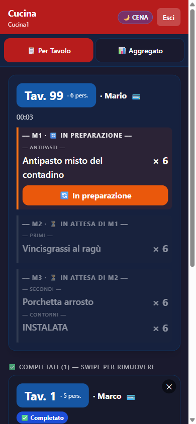

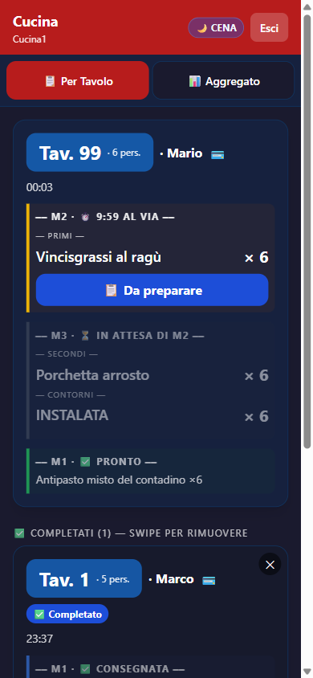

### 3.3 Blocco sequenziale: M2 attende M1

La M2 di un tavolo è **grigia e bloccata** finché la M1 non è pronta. Vedrai scritto `⏳ In attesa di M1`.

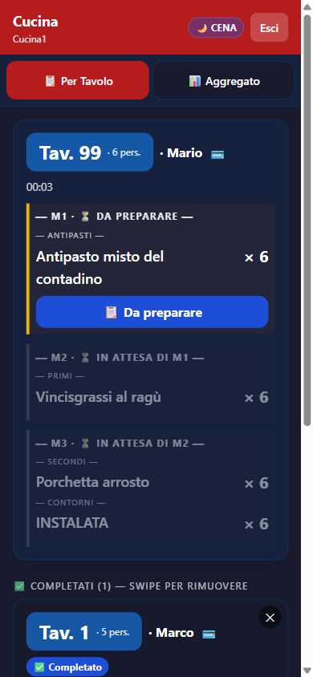

Quando premi "Pronto" sulla M1, la M2 si sblocca automaticamente e prende il colore giallo "Da preparare".

> 💡 Il timer arancione che vedi in alcune mandate indica quanto manca prima che la prossima diventi **urgente** (bordo rosso, lampeggia). È solo un promemoria, niente di automatico.

### 3.4 Vista Aggregata

Premi **📊 Aggregato** in alto per vedere **quanti pezzi per pietanza** ti servono in totale — utile per impiattare a blocchi.

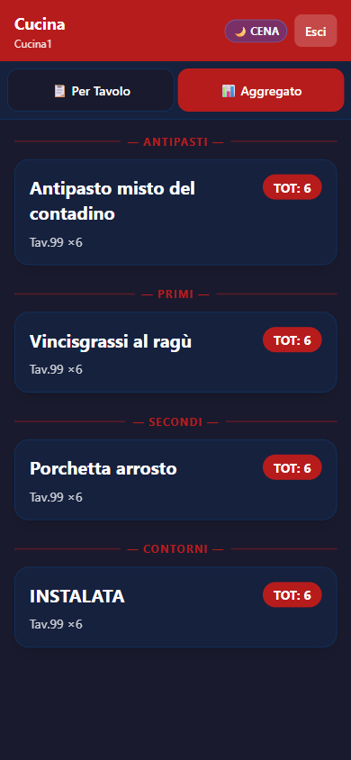

### 3.5 Tavoli completati

Quando tutte le mandate di un tavolo sono pronte o consegnate, il tavolo scende in fondo alla lista con il badge **✅ Completato**. Puoi rimuoverlo dalla schermata con uno **swipe** orizzontale o con la **X** in alto a destra.

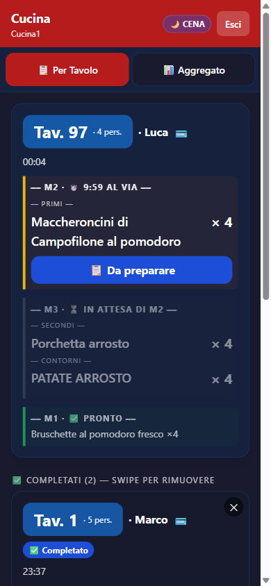

> 💡 La M4 (dolci) NON arriva automaticamente: appare solo quando il cameriere preme "Invia M4". Finché non la vedi, non c'è.

---

## 4) Guida Bar

Il bar funziona come la cucina, con due differenze importanti:

1. Le mandate bar **non sono bloccate in sequenza** — puoi preparare M1 e M2 in parallelo.
2. Dopo "Pronto" la card NON sparisce da sola: la rimuovi con uno **swipe**.

### 4.1 Schermata bar

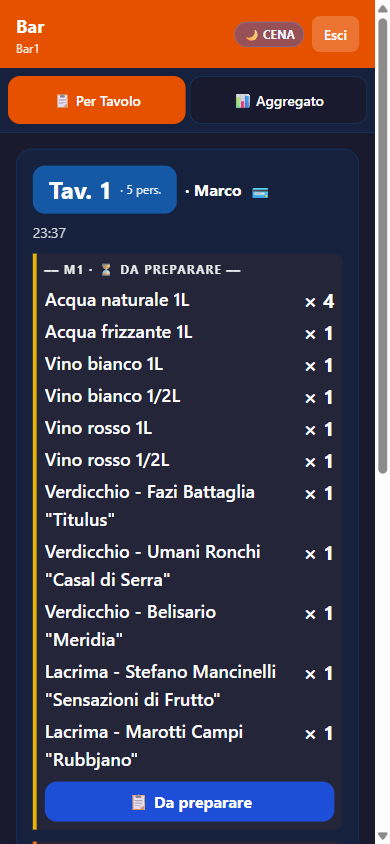

Stesso flusso a 3 pulsanti della cucina: **Da preparare → In preparazione → Pronto**.

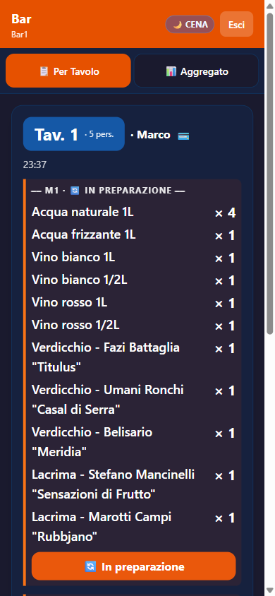

### 4.2 Pronto: swipe per rimuovere

Quando una card è tutta pronta, fai uno **swipe** (trascina con il dito da sinistra o da destra) per rimuoverla dalla schermata. In alternativa, premi la **X** in alto a destra della card.

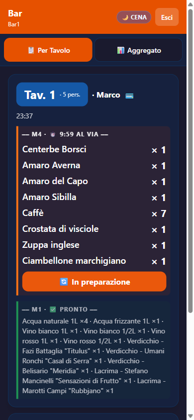

> 💡 Lo swipe è solo un'azione visiva: rimuove la card dal tuo schermo ma non cambia lo stato sul database. Serve per "fare pulizia" mentre la sera procede.

### 4.3 M4: caffè e amari **bloccati** all'inizio

I caffè e gli amari (M4) **non compaiono** finché il cameriere non preme "Invia M4". È normale: il bar non deve preparare il caffè all'inizio della cena.

Quando il cameriere invia M4, vedi comparire le nuove voci (dolci dalla cucina + caffè/amari dal bar) con un nuovo blocco M4 nelle card.

> ⚠️ Se ti pare che manchino i caffè di un tavolo, non chiamare l'admin: chiedi al cameriere se ha già inviato M4. La maggior parte delle volte è quello.

### 4.4 Riordini in arrivo

Quando un cameriere usa la funzione **Riordino Rapido** per un tavolo già seduto, ti arriva una nuova card con il nome del cliente seguito da **"(riordino)"**. Funziona come un ordine normale: stesso flusso "Da preparare → In preparazione → Pronto", tutto in M1.

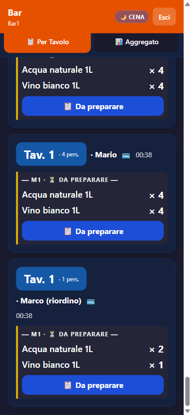

> 💡 Il "(riordino)" nel nome ti dice solo "questo è arrivato dopo, è un'aggiunta": non cambia nulla nella preparazione.

---

## 5) Guida Cassa

La cassa incassa i contanti e ri-conferma gli ordini stornati.

### 5.1 Lista ordini in attesa

Appena fai login vedi la **lista degli ordini in attesa di incasso**. Ogni card mostra tavolo, nome, totale e l'ora.

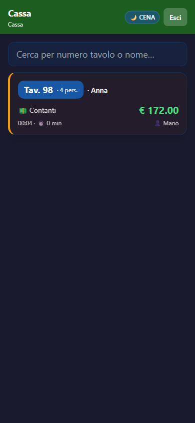

Puoi filtrare per numero tavolo o nome con la barra di ricerca in alto.

### 5.2 Incassa un ordine

Tocca una card per aprire il dettaglio. Vedi il totale, gli articoli ordinati e un grosso pulsante verde **✅ Incassato**.

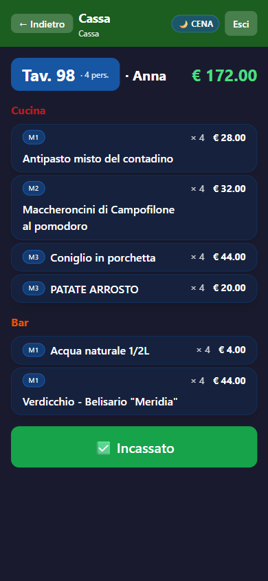

Confermi e l'ordine torna in cucina/bar come "confermato". Da quel momento parte la preparazione effettiva.

### 5.3 Ordine stornato: scegli il metodo di pagamento

Se un ordine arriva con il bordo **rosso** e il badge "STORNATO", significa che il cameriere lo ha rimesso in pausa (es. il cliente ha cambiato metodo di pagamento). Aprendolo trovi **due pulsanti**, non uno solo:

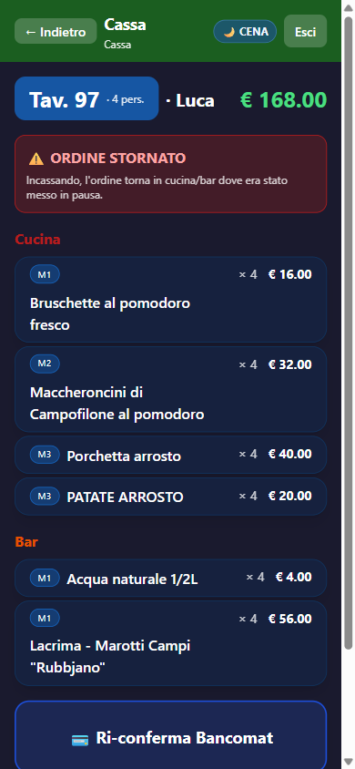

- 💳 **Ri-conferma Bancomat** — l'ordine torna attivo come pagato con bancomat
- 💵 **Ri-conferma Contanti** — l'ordine torna attivo come pagato in contanti

Scegli il metodo che il cliente ha effettivamente usato.

> ⚠️ Anche se la cassa è solo "contanti" sulla carta, il sistema permette il ri-conferma a bancomat per gestire i cambi di idea del cliente.

### 5.4 Dopo l'incasso

Dopo che premi "Incassato" o "Ri-conferma X", l'ordine sparisce dalla lista. La lista mostra solo gli ordini ancora da incassare.

---

## 6) Guida Admin

L'admin gestisce menu, staff, impostazioni e vede tutti gli ordini. Ha 5 tab in alto: **Ordini**, **Menu**, **Riepilogo**, **Staff**, **⚙️ (Impostazioni)**.

### 6.1 Tab Ordini

Vedi tutti gli ordini (attivi, completati, stornati) con filtri per stato. Da qui puoi anche cancellare un singolo ordine se necessario.

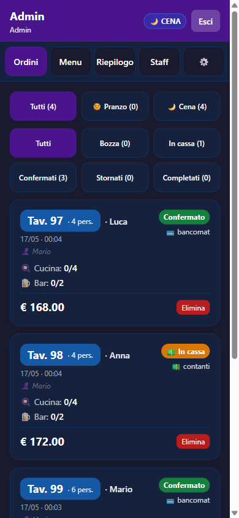

### 6.2 Tab Menu

Da qui aggiungi/modifichi/disattivi i piatti e le bevande del menu. Ogni piatto cucina ha una **sottocategoria** (antipasto, primo, secondo, contorno, dolce) che determina automaticamente in quale mandata finisce.

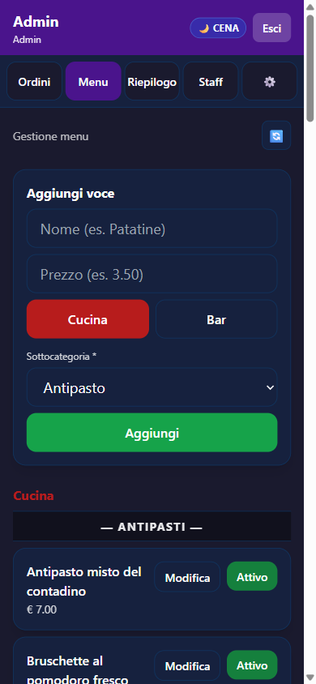

Lo stesso tab permette di gestire il menu bar (acqua, vino, caffè, amari). Scorri in basso oltre la sezione Cucina e trovi la sezione **Bar** con la sua lista:

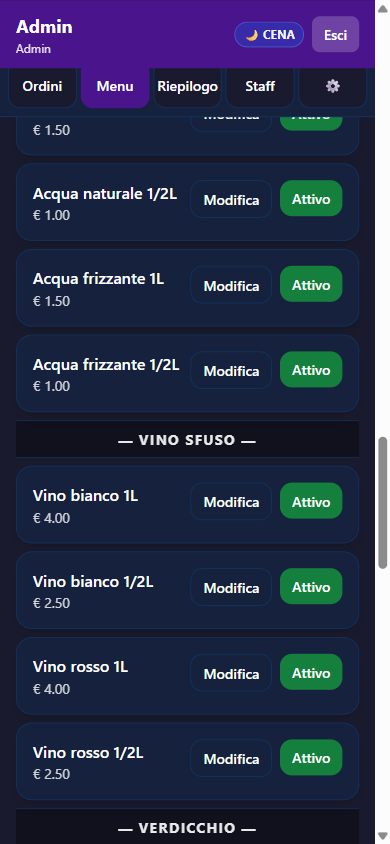

Per aggiungere una nuova voce, usa il pulsante "Cucina" o "Bar" nel form in alto e scegli la sottocategoria (solo per cucina).

### 6.3 Tab Riepilogo

Statistiche della serata: totali incassi, numero persone servite, breakdown bancomat/contanti, ecc. È la pagina che monitoriamo durante la sagra.

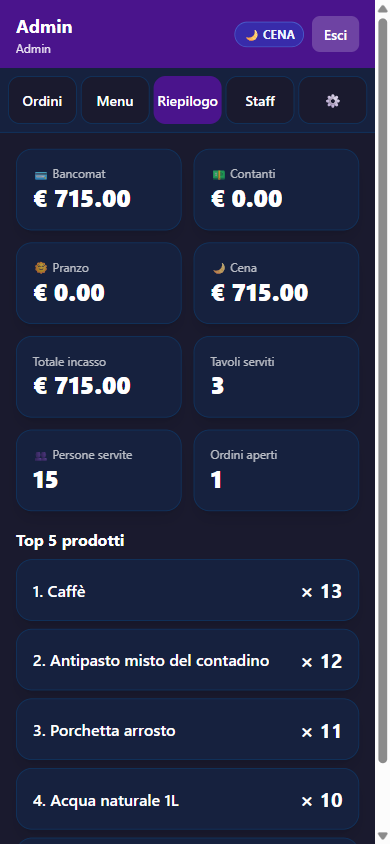

### 6.4 Tab Staff

Elenco di tutto il personale con i loro PIN e ruoli. Da qui puoi:

- Aggiungere un nuovo membro dello staff
- Cambiare PIN
- Inviare le credenziali via **WhatsApp** con un click (apre WhatsApp con il messaggio precompilato)
- Disattivare temporaneamente un membro

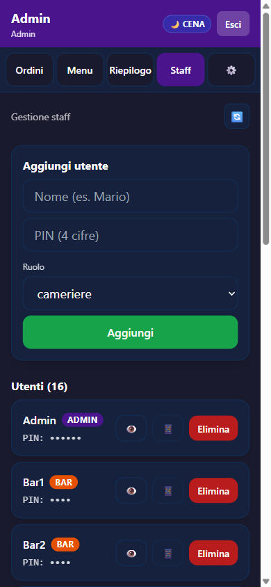

### 6.5 Tab ⚙️ Impostazioni — Fasce orarie

In questa pagina configuri le **fasce orarie** (colazione, pranzo, aperitivo, cena) con orari di inizio e fine. L'app le usa per assegnare automaticamente ogni ordine al servizio giusto.

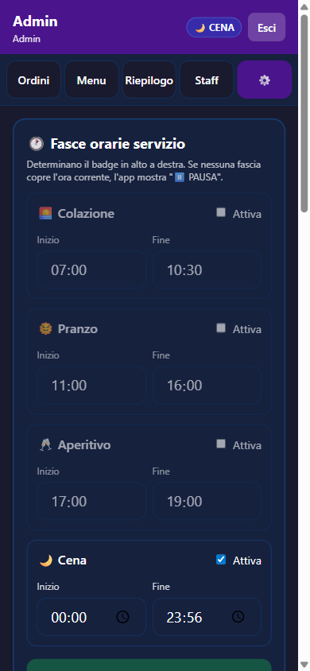

> 💡 La fascia "cena" può attraversare la mezzanotte (es. inizio 18:00, fine 02:00). L'app la gestisce correttamente.

### 6.6 Tab ⚙️ Impostazioni — Timer mandate

Più sotto trovi i tempi di preparazione e consumo per ogni portata. Servono al timer arancione che vedi in cucina/bar.

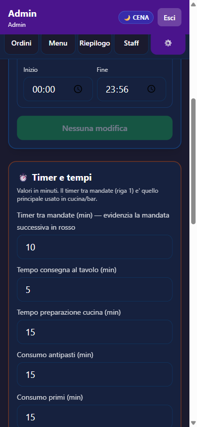

Valori sensati di default:
- Consumo antipasto: 15 min
- Consumo primo: 20 min
- Consumo secondo/contorno: 25 min
- Consumo dolce: 10 min
- Timer mandate (urgenza): 10 min

### 6.7 Tab ⚙️ Impostazioni — Reset e manutenzione

In fondo alla pagina trovi i pulsanti di **reset** della serata (cancella tutti gli ordini) e il messaggio di benvenuto staff.

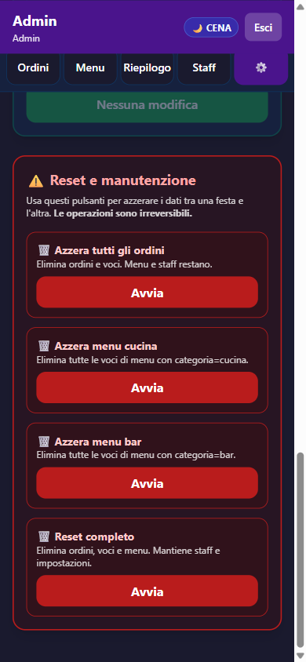

> ⚠️ **Il reset è irreversibile**. Usalo solo a fine serata, dopo aver verificato il riepilogo finale.

---

## Domande frequenti

**Sono cameriere e ho dimenticato di inviare M4. Cosa succede?**
Cucina e bar non hanno mai visto le voci M4. Vai sul dettaglio del tavolo e premi "Invia M4" anche adesso — partiranno comunque.

**Sono cucina e una mandata non si sblocca.**
Verifica che la mandata precedente sia stata marcata **"Pronto"** (verde), non solo "In preparazione".

**Sono bar e mi mancano i caffè di un tavolo.**
Il cameriere non ha ancora premuto "Invia M4". Aspetta o chiediglielo.

**Sono cassa e un ordine è "stornato": cosa scelgo?**
Chiedi al cliente con quale metodo paga (contanti o bancomat) e premi il pulsante corrispondente.

**Sono cameriere, un cliente già seduto vuole una bottiglia in più. Devo aprire un nuovo tavolo?**
No: usa il pulsante **+ Riordino** azzurro in basso a destra sulla card del suo tavolo. Si apre una schermata con lista unica e barra di ricerca, scegli quello che serve e paghi. Velocissimo.

**L'app è lenta o si blocca.**
Ricarica la pagina (tira giù dall'alto sul cellulare). Il login resta salvato.

---

*SagràApp v5 — Buona serata!* 🎉
